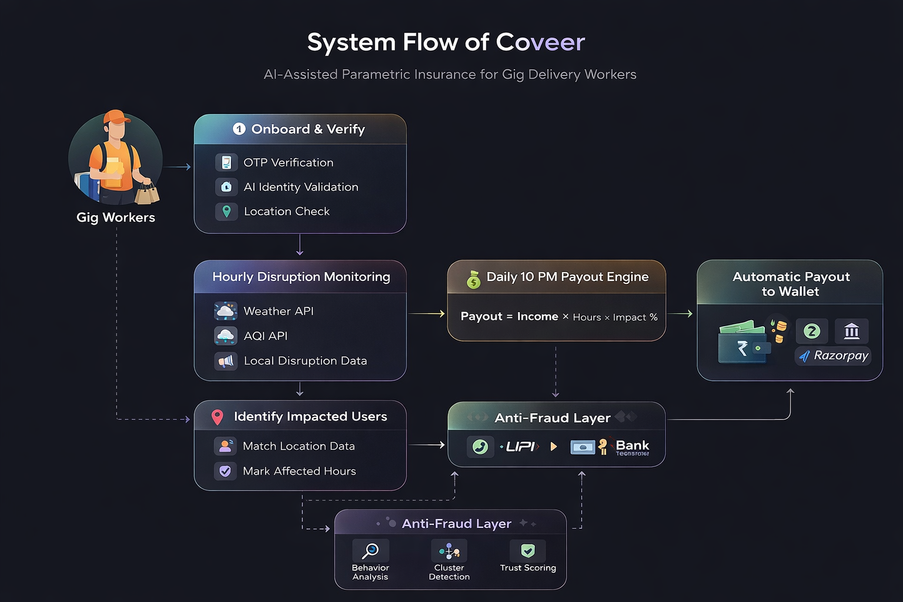

# 🛡️ Coveer

***Insurance that works as fast as you do.***

---

## 📌 Problem Statement

India’s gig delivery workers (Zomato, Swiggy) rely on **daily earnings**.
However, disruptions like **heavy rain**, **heat**, **pollution**, or **curfews** can suddenly stop their work, resulting in a loss of immediate earnings.

There exists **no system to protect daily earnings** of gig delivery workers from such disruptions that are beyond their control.

---

## 💡 Solution Overview

**Coveer** is an **AI-assisted parametric insurance platform** that:

* Monitors disruptions in the real world **every hour**
* Monitors **the duration of impact on workers**
* Calculates **actual income loss**
* Processes **daily payouts (10 PM settlement)**
* Designed **specifically for India’s gig economy scale**

> **🎯 Key Idea:**
> We don’t verify claims; we **measure impact and pay automatically**.

---

## 👤 Target Persona

### Delivery Partner (Swiggy / Zomato)

* Age: 18-45 years
* Income: **Daily earnings** (500-1500 INR/day)
* Work Nature: Highly disruption-sensitive; works outdoors

### Pain Points:

* Income stops during rain/heat/pollution
* No system to protect daily earnings
* Unstable finances
  
---

## 🔄 Product Workflow

### 1. User Onboarding & Verification

* User Signs Up With:
  * Phone Number: OTP Verification
  * Platform Identity: ID/Screenshot/Mock Verification

- **AI-based Identity Validation**
  - AI-based image verification to validate if ID/Screenshot is real or fake  
  - AI-based image verification to validate if ID/Screenshot is blurry or edited  

- **Location Verification**
  - User has to allow access to location services  
  - System verifies if the user is actually working in that city/zone  

* **Minimal friction onboarding process (less than 2 minutes)** designed specifically for gig workers  

* System Stores:
  * City/Working Zone
  * Average Daily Income
  * Subscription Plan  

---

### 2. Hourly Disruption Monitoring 🔥

**System runs every hour:**

* Weather API: rain, temperature
* AQI API: pollution levels
* Local disruption signals: mock API  

Each hour is categorized as:

```text
Affected → worker cannot operate normally  
Not Affected → normal working conditions  
```

---

### 3. User Impact Tracking

For each worker:

* System matches:

  * Worker location
  * Hourly disruption data

* Tracks:

```text
Total Affected Hours per Day
```

**Example:**

```text
2 PM → Heavy Rain → Affected  
3 PM → Heavy Rain → Affected  
4 PM → Normal → Not Affected  

Total Impact = 2 hours
```

---

### 4. 10 PM Daily Settlement Engine 💰

At **10 PM**, system performs:

* Fetch all active users
* Calculate total affected hours
* Compute payout
* Credit wallet instantly

---

## 🔄 System Flow Diagram



---

## ⚡ Parametric Trigger System

For automated payouts, Coveer employs a **parametric trigger system**.

* Continuously monitors real-world events (rain, heat, AQI, etc.)
* When thresholds are met, it:
  * Identifies affected zones
  * Matches users within those zones
  * Automatically makes payouts

> **Zero-touch system**, no manual claims or approvals required. Triggers are based on external data.

---

## 💰 Payout Model

### Formula

```text
Payout = Hourly Income * Affected Hours
```

### Example

```text
Hourly Income: ₹150  
Affected Hours: 3  

Payout: ₹450  
```

---

### Plan Limits

| Plan    | Weekly Cost | Max Daily Payout |
| ------- | ----------- | ---------------- |
| Basic   | ₹25/week    | ₹600             |
| Premium | ₹40/week    | ₹1000            |

---

## 🤖 Role of AI (**Practical & Focused**)

The role of AI in our application:

### 1. Risk-Based Premium Calculation

The application uses AI for:

* City-level weather pattern analysis  
* Pollution pattern analysis  
* Historical disruption analysis  

**Output:**

```text
High Risk City → High Premium  
Low Risk City → Low Premium  
```

---

### 2. Disruption Severity Modeling

Coveer does not use traditional disruption-based triggering methods. Instead, we use **percentage-based impact modeling** for our application:

```text
Light Rain → 30% impact (reduced efficiency)  
Heavy Rain → 60% impact (major slowdown)  
Extreme Weather → 100% impact (no deliveries)  
```

---

### 3. Fraud Detection (**Cluster-Based**)

AI detects:

* Repeated abnormal behavior
* Multiple users exhibiting the same behavior
* Clusters of abnormal behavior

---

## 🚨 Market Crash: Adversarial Defense & Anti-Spoofing Strategy

### 🧨 Problem

Fraud rings are exploiting the system by:

* Spoofing GPS
* Making coordinated claims
* Triggering claims

---

## 🛡️ Our Defense Approach

### 1. No Claim-Based System (**Biggest Defense**)

* Users **never make claims**
* Triggers are automated

👉 No claim-based system eliminates the biggest fraud entry point

---

### 2. Multi-Layer Location Validation

We validate the user's location by:

* GPS consistency checks
* IP matching
* Historical movement patterns

---

### 3. Behavioral Analysis

System can identify anomalies such as:

* User always “affected” every day
* No movement during working hours
* Unreasonable patterns of behavior

---

### 4. Cluster Fraud Detection 🔥

We can identify fraud rings through:

* Same location + same timing
* Similar behavior
* Similar patterns

**Action:**

→ Flag cluster  
→ Delay or block payouts  

---

### 5. Trust-Based Scoring

Each user has a **trust score**:

| Score Type | Action             |
| ---------- | ------------------ |
| High Trust | Instant payout     |
| Medium     | Light verification |
| Low        | Flag / delay       |

---

### 6. Fairness Mechanism

* First-time users are trusted
* Soft warnings instead of strict action
* Genuine users are not penalized

---

## 💳 Payout System

* Internal wallet system
* Instant credit for users at **10 PM**
* Transaction history is tracked

### Withdrawal Flow

* Users can withdraw their wallet amount through:

  * UPI
  * Bank transfer
  * **Razorpay** 

**Example:**

```text
+₹450 Rain Impact Payout  
-₹20 Weekly Premium  
+₹300 Heatwave Compensation  
```

---

## 📊 Dashboard (Planned)

### Worker Dashboard

* Active plan
* Wallet balance
* Earnings are always protected
* Daily impact summary

---

### Admin Dashboard

* Total users
* Active disruptions
* Fraud alerts
* Risk zones
* Loss ratios (premium and payouts)
* Predicted high-risk zones (using AI)

---

## 🧱 Tech Stack

**Frontend**

* React.js

**Backend**

* Node.js + Express.js

**Database**

* MongoDB

**APIs**

* Open Weather API
* AQI API
* Disruptions (Mock) API

**AI Layer**

* Python / ML models for Risk and Fraud Detection

---

## 🎯 Why Coveer Stands Out

* Practical and Scalable
* Accurate **Time-Based Compensation**
* No Manual Claim Dependency
* Robust Anti-Fraud
* Practical and Deployable

---

## 🚀 Conclusion

**Coveer** is a revolutionary change in how we think of **Insurance as a Service**. It moves from a traditional **claim-based system** to a **real-time income protection system**.

It provides gig workers with a sense of financial security in a world that is increasingly uncertain.